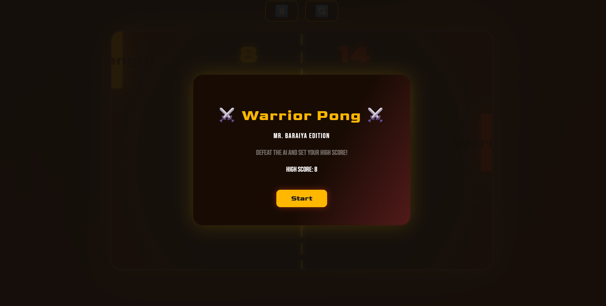

# Pong Game

A classic Pong Game recreated using HTML, CSS, and JavaScript. This project demonstrates simple 2D game logic including animation, collision detection, and score tracking.

## Live Demo

Play it here: [https://mr-baraiya.github.io/Pong-Game/](https://mr-baraiya.github.io/Pong-Game/)

## Features

- Player vs Computer paddle
- Real-time ball movement
- Paddle collision detection
- Score tracking
- Simple AI opponent
- Responsive canvas rendering

## Folder Structure

```

Pong-Game/
├── index.html        # Main HTML file
├── style.css         # Game styling
└── script.js         # Game logic and animation

````

## How to Run Locally

1. Clone the repository:
```bash
   git clone https://github.com/mr-baraiya/Pong-Game.git
````

2. Open `index.html` in your browser.

## Preview



*(Add a screenshot named `preview.png` to show your game UI)*

## 💡 Technologies Used

* HTML5 Canvas
* CSS3
* JavaScript (Vanilla)

## 📜 License

This project is open source and available under the [MIT License](LICENSE).

Feel free to contribute or fork this project. ⭐ it if you enjoyed the game!

